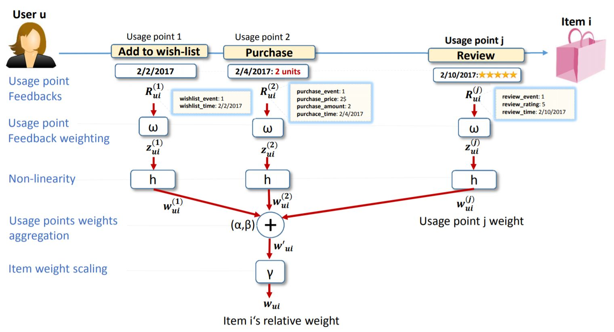

CDMF: A Collaborative Filtering Method for Handling Diverse and Repetitive User-Item Interactions
====

This repository provides a reference implementation of *CDMF* as described in the paper:<br>
> A Collaborative Filtering Method for Handling Diverse and Repetitive User-Item Interactions<br>
> Oren Sar Shalom, Haggai Roitman, Amihood Amir, Alexandros Karatzoglou<br>
> Proceedings of the 29th on Hypertext and Social Media, 2018<br>
> https://dl.acm.org/doi/10.1145/3209542.3209550<Insert paper link>

The *CDMF* algorithm is capable of incorporating arbitrary and diverse feedback types without any prior domain knowledge


## Requirements
 - torch
 - pytorch_lightning

## Citation

```
@incollection{sar2018collaborative,
  title={Collaborative filtering method for handling diverse and repetitive user-item interactions},
  author={Sar Shalom, Oren and Roitman, Haggai and Amir, Amihood and Karatzoglou, Alexandros},
  booktitle={Proceedings of the 29th on Hypertext and Social Media},
  pages={43--51},
  year={2018}
}
```
